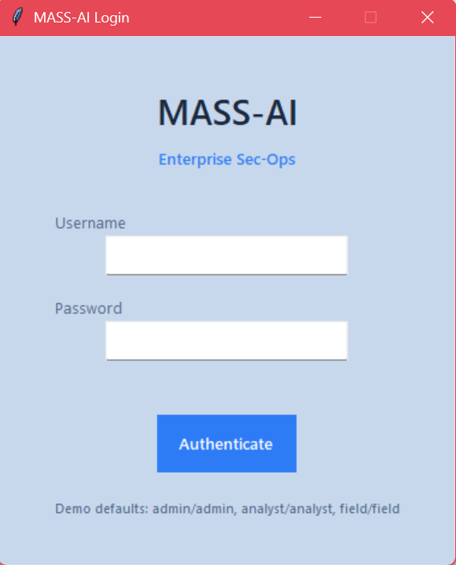

<div align="center">

# MASS AI Project

### Milli Akıllı Sayaç Sistemleri — AI-Powered Electricity Theft Detection

**Anomaly Detection & Theft Classification for Turkey's National Smart Meter Infrastructure**

[](https://www.python.org/)
[](https://scikit-learn.org/)
[](https://xgboost.readthedocs.io/)
[](https://tensorflow.org/)
[](https://streamlit.io/)
[](LICENSE)
[](https://www.microsoft.com/windows)

</div>

---

## Overview

**MASS AI** is a production-ready machine learning system designed to detect electricity theft and consumption anomalies from smart meter data. Built to support Turkey's MASS (Milli Akıllı Sayaç Sistemi) initiative — a national deployment of 50 million smart meters by 2028 — the system addresses regions where electricity theft rates exceed **28%**, causing **billions of TL in annual losses**.

The project combines a **desktop analyst workstation** (Tkinter), an **interactive web dashboard** (Streamlit), and a **research pipeline** (6 ML models) under a single unified launcher.

---

## Screenshots

| Login | Main Workspace |
|---|---|
|  |  |

| Overview & Model Performance | Priority Watchlist |
|---|---|
|  |  |

| Risk Curve | Risk Mix by Band |
|---|---|
|  |  |

<div align="center">

**Model Quality — ROC-AUC & F1**


</div>

---

## Key Features

- **6 ML Models** — Isolation Forest, XGBoost, Random Forest, Gradient Boosting, LSTM Autoencoder, Stacking Ensemble
- **8 Theft Patterns** — Meter tampering, cable bypass, peak clipping, gradual reduction, and more
- **20+ Engineered Features** — Statistical, temporal, and anomaly-based feature extraction
- **Stacking Ensemble ROC-AUC: 0.9428** — Research-grade accuracy on synthetic Turkish smart meter data
- **Ops Center** — SQLite-backed case management with audit trail (Created → Analyzed → Escalated → Resolved)
- **Interactive Dashboard** — 5-tab Streamlit UI with regional map, risk histograms, alarm queue
- **Desktop Analyst Tool** — Glass-morphism Tkinter app with case management, chart export, HTML reports
- **Synthetic Data Engine** — 2,000 customers × 180 days at 15-min intervals, 4 regional presets

---

## Model Performance

| Model | ROC-AUC | F1 Score | Avg Precision | Type |
|---|---|---|---|---|
| **Stacking Ensemble** | **0.9428** | **0.8727** | **0.9004** | Ensemble |
| Random Forest | 0.9461 | 0.8704 | — | Supervised |
| Gradient Boosting | 0.9380 | 0.8411 | — | Supervised |
| XGBoost | 0.9322 | 0.8440 | — | Supervised |
| LSTM Autoencoder | 0.7482 | 0.5600 | — | Deep Learning |
| Isolation Forest | 0.8208 | 0.2609 | — | Unsupervised |

> Evaluated on 2,000 synthetic customers (12% theft rate) across 4 Turkish regional profiles.

---

## Models In Detail

MASS-AI uses a layered model strategy: unsupervised detection for label-free deployment, supervised classifiers for maximum accuracy when labels are available, deep learning for raw time-series patterns, and a stacking ensemble that combines all signals into a single calibrated score.

---

### 1. Isolation Forest — Unsupervised Anomaly Detection

**How it works:** Builds an ensemble of random decision trees. Anomalous customers (thieves) are isolated in fewer splits because they occupy sparse, unusual regions of the feature space. The fewer splits needed, the higher the anomaly score.

**Why it matters here:** Requires **no labeled theft data** to train — making it deployable on day one of a smart meter rollout before any confirmed fraud cases have been collected.

**Strengths:** Label-free, fast, interpretable score, handles high-dimensional feature spaces well.  
**Limitations:** Struggles when theft patterns overlap heavily with legitimate low-consumption behavior (F1: 0.26 reflects this).  
**Best used for:** Initial screening, cold-start deployments, regions with zero historical fraud labels.

---

### 2. XGBoost — Gradient Boosted Trees

**How it works:** Builds trees sequentially, where each new tree corrects the residual errors of the previous one. Uses second-order gradient information (Newton boosting) for faster convergence and better regularization than standard gradient boosting.

**Why it matters here:** Handles the class imbalance (88% normal vs 12% theft) well through `scale_pos_weight`. Produces native feature importance scores that directly answer: *"which consumption pattern drove this suspicion?"*

**Strengths:** High accuracy, built-in regularization (L1/L2), fast training, excellent feature importance.  
**Limitations:** Requires labeled training data; less interpretable than a single decision tree.  
**Best used for:** Primary scoring engine when labeled historical fraud data is available.

---

### 3. Random Forest — Supervised Ensemble Classifier

**How it works:** Trains hundreds of decision trees on random subsets of data and features (bagging + feature randomness). Final prediction is a majority vote across all trees. The randomness reduces overfitting significantly compared to a single deep tree.

**Why it matters here:** Achieves the highest standalone ROC-AUC (0.9461) in this evaluation. Naturally robust to noisy features and outliers in consumption data. Per-tree predictions also provide a natural confidence estimate.

**Strengths:** Robust to noise, provides reliable probability estimates, resistant to overfitting.  
**Limitations:** Memory-heavy with many trees; less effective on very sparse or highly imbalanced datasets without weighting.  
**Best used for:** Reliable baseline scorer and cross-validation reference model.

---

### 4. Gradient Boosting — Sequential Error Correction

**How it works:** Similar to XGBoost in principle but uses first-order gradients (classic scikit-learn implementation). Each tree is fit to the negative gradient of the loss function — progressively reducing the prediction error with each stage.

**Why it matters here:** Provides a strong secondary classifier that behaves differently from XGBoost due to different regularization and split strategies, making it a valuable member of the stacking ensemble.

**Strengths:** Strong accuracy, well-understood behavior, good probability calibration.  
**Limitations:** Slower to train than XGBoost; sensitive to learning rate and tree depth hyperparameters.  
**Best used for:** Ensemble diversity — its slightly different error patterns complement XGBoost and Random Forest.

---

### 5. LSTM Autoencoder — Deep Learning Time-Series Model

**How it works:** A sequence-to-sequence neural network (Long Short-Term Memory) trained to *reconstruct* normal consumption sequences. Anomalies produce high reconstruction error because the model was never trained on theft patterns — it only learned what "normal" looks like.

The architecture:
```
Input sequence (180 days × features)
        │
   LSTM Encoder  →  compressed latent vector
        │
   LSTM Decoder  →  reconstructed sequence
        │
Reconstruction Error → Anomaly Score
```

**Why it matters here:** Operates directly on raw time-series without handcrafted features. Can detect novel theft patterns not represented in the engineered feature set — useful as consumption behaviors evolve over time.

**Strengths:** No feature engineering required, detects novel/unseen patterns, models temporal dependencies naturally.  
**Limitations:** Requires TensorFlow, more compute, harder to explain to field analysts, performs worse on short time windows (ROC-AUC: 0.748).  
**Best used for:** Secondary validation signal, detecting pattern-drifted or novel fraud types.

---

### 6. Stacking Ensemble — Meta-Learner

**How it works:** A two-layer system. In Layer 1, all five models above independently produce a probability score for each customer. In Layer 2, a meta-learner (Logistic Regression) is trained on these five scores as its input features — learning *how to weight and combine* each model's judgment.

```
Layer 1 (Base Models):
  Isolation Forest  →  score_1
  XGBoost           →  score_2   ┐
  Random Forest     →  score_3   ├─► Meta-Learner → Final Risk Score
  Gradient Boosting →  score_4   ┘
  LSTM Autoencoder  →  score_5

Layer 2 (Meta-Learner):
  Logistic Regression trained on [score_1 … score_5]
```

**Why it matters here:** Compensates for each model's individual weaknesses. When Isolation Forest is uncertain (low-confidence anomaly) but XGBoost and Random Forest both flag a customer, the meta-learner can still produce a high risk score. The ensemble is more robust than any single model.

**Strengths:** Best overall operational performance (F1: 0.8727, AP: 0.9004), robust to individual model failures.  
**Limitations:** Requires all base models to be trained and loaded; adds latency compared to single-model inference.  
**Best used for:** **Production scoring** — this is the default model for the desktop app and dashboard.

---

```
MASS_AI_UNIFIED_APP/
├── MASS_AI_LAUNCHER.py          # Unified launcher (Tkinter)
├── START_MASS_AI.bat            # Quick start entry point
├── START_MASS_AI_DESKTOP.bat    # Direct desktop launch
├── INSTALL_REQUIREMENTS.bat     # One-click dependency install
├── RUN_SMOKE_TESTS.bat          # Run test suite
├── BUILD_DESKTOP_EXE.bat        # Package to .exe (PyInstaller)
│
├── project/                     # Main application
│   ├── mass_ai_desktop.py       # Desktop analyst application
│   ├── mass_ai_engine.py        # ML engine + synthetic data generator
│   ├── mass_ai_domain.py        # Domain utilities & report formatting
│   ├── ops_store.py             # SQLite Ops Center persistence
│   ├── ui_kit.py                # Custom Tkinter UI components
│   ├── app_metadata.py          # Version & build info
│   ├── support_bundle.py        # ZIP support export
│   │
│   ├── dashboard/
│   │   └── app.py               # Streamlit web dashboard (5 tabs)
│   │
│   ├── legacy_pipeline/         # Research & experimental models
│   │   ├── generate_synthetic_data.py
│   │   ├── theft_detection_model.py
│   │   ├── lstm_autoencoder.py
│   │   ├── advanced_pipeline.py
│   │   └── run_pipeline.py      # Full pipeline orchestrator
│   │
│   └── tests/
│       ├── test_mass_ai_engine.py
│       └── test_ops_center.py
│
├── docs/                        # Architecture & design docs
├── images/                      # Screenshots & result plots
└── business_docs/               # Research materials & presentations
```

---

## Quick Start

### 1. Clone the repository

```bash
git clone https://github.com/Technet43/MASS-A-Project.git
cd MASS-A-Project
```

### 2. Install dependencies

**Option A — One-click (Windows):**
```
INSTALL_REQUIREMENTS.bat
```

**Option B — Manual:**
```bash
# Desktop only (lightweight)
pip install -r project/requirements-desktop.txt

# Full stack (includes TensorFlow, Streamlit, SHAP)
pip install -r project/requirements-full.txt
```

### 3. Launch

```bash
# Unified launcher (recommended)
START_MASS_AI.bat

# Desktop app directly
START_MASS_AI_DESKTOP.bat

# Streamlit web dashboard
streamlit run project/dashboard/app.py

# Research pipeline
python project/legacy_pipeline/run_pipeline.py --quick
python project/legacy_pipeline/run_pipeline.py --all
```

---

## Synthetic Dataset

The built-in data engine generates realistic Turkish smart meter data without requiring external datasets:

| Parameter | Value |
|---|---|
| Customers | 2,000 |
| Duration | 180 days |
| Interval | 15 minutes |
| Theft Rate | 12% |
| Customer Profiles | Residential (70%), Commercial (20%), Industrial (10%) |
| Regional Presets | Metro, Coastal, Plateau, Rural |

**8 Theft Patterns Simulated:**

| Pattern | Description |
|---|---|
| `constant_reduction` | Uniform consumption drop — meter tampering |
| `night_zeroing` | Zero readings at night — cable bypass |
| `random_zeros` | Sporadic zero readings |
| `gradual_decrease` | Slow monthly reduction — progressive theft |
| `peak_clipping` | Peak cutoff — current limiter device |
| `weekend_masking` | Weekend anomalies — retail bypass |
| `intermittent_bypass` | Intermittent bypass activity |
| `tamper_spikes` | High-value spikes — meter manipulation |

---

## Architecture

```
Smart Meter Data
       │
       ▼
Feature Engineering (20+ features)
  Statistical: mean, std, skewness, kurtosis
  Temporal:    night/day ratio, peak hour, weekday/weekend diff
  Anomaly:     zero%, sudden change ratio, trend slope
       │
       ▼
┌─────────────────────────────────────────┐
│           Model Ensemble                │
│  ┌──────────┐  ┌──────────┐            │
│  │Isolation │  │ XGBoost  │            │
│  │  Forest  │  │          │            │
│  └──────────┘  └──────────┘            │
│  ┌──────────┐  ┌──────────┐            │
│  │  Random  │  │Gradient  │            │
│  │  Forest  │  │Boosting  │            │
│  └──────────┘  └──────────┘            │
│  ┌──────────┐                          │
│  │   LSTM   │ ──► Stacking Ensemble    │
│  │Autoencdr │     (Meta-learner)       │
│  └──────────┘                          │
└─────────────────────────────────────────┘
       │
       ▼
Risk Score + Theft Pattern Classification
       │
       ▼
Ops Center (Case Management / Audit Trail)
```

---

## Requirements

| Package | Version | Purpose |
|---|---|---|
| Python | 3.10+ | Runtime |
| scikit-learn | 1.3+ | Core ML models |
| xgboost | 2.0+ | Gradient boosting |
| numpy | 1.24+ | Numerical computing |
| pandas | 2.0+ | Data processing |
| matplotlib | 3.7+ | Desktop charts |
| streamlit | 1.30+ | Web dashboard |
| plotly | 5.18+ | Interactive charts |
| tensorflow | 2.15+ | LSTM Autoencoder |
| shap | 0.43+ | Model explainability |
| openpyxl | 3.1+ | Excel export |

---

## Development

```bash
# Run tests
RUN_SMOKE_TESTS.bat
# or
python -m pytest project/tests/ -v

# Build Windows executable
BUILD_DESKTOP_EXE.bat
```

---

## Roadmap

- [x] Synthetic data generation (2,000 customers × 180 days)
- [x] Isolation Forest, XGBoost, Random Forest, Gradient Boosting models
- [x] LSTM Autoencoder for time-series anomaly detection
- [x] Stacking Ensemble + SHAP explainability
- [x] Streamlit Dashboard v2.0 (5 tabs + regional map)
- [x] Desktop Analyst App with Ops Center (SQLite)
- [x] Executive brief generation (HTML/text)
- [x] PyInstaller packaging for Windows
- [ ] Real dataset integration (SGCC, London Smart Meter)
- [ ] 1D-CNN voltage anomaly classification
- [ ] ESP32 + CT sensor hardware prototype
- [ ] REST API for utility company integration

---

## Context

Turkey's TEDAŞ and BAŞKENTEDAŞ distribution companies face **28%+ electricity theft rates** in some regions, accounting for an estimated **₺10+ billion in annual losses**. The MASS initiative (50 million smart meters by 2028) will generate massive time-series data streams requiring automated anomaly detection at scale. This project demonstrates a viable ML architecture for that challenge.

---

## Author

**Ömer Burak Koçak**  
Electrical-Electronics Engineering, Marmara University (graduating 2028)  
[kocakomerburak075@gmail.com](mailto:kocakomerburak075@gmail.com)

---

## License

[MIT License](LICENSE) — free to use, modify, and distribute with attribution.
