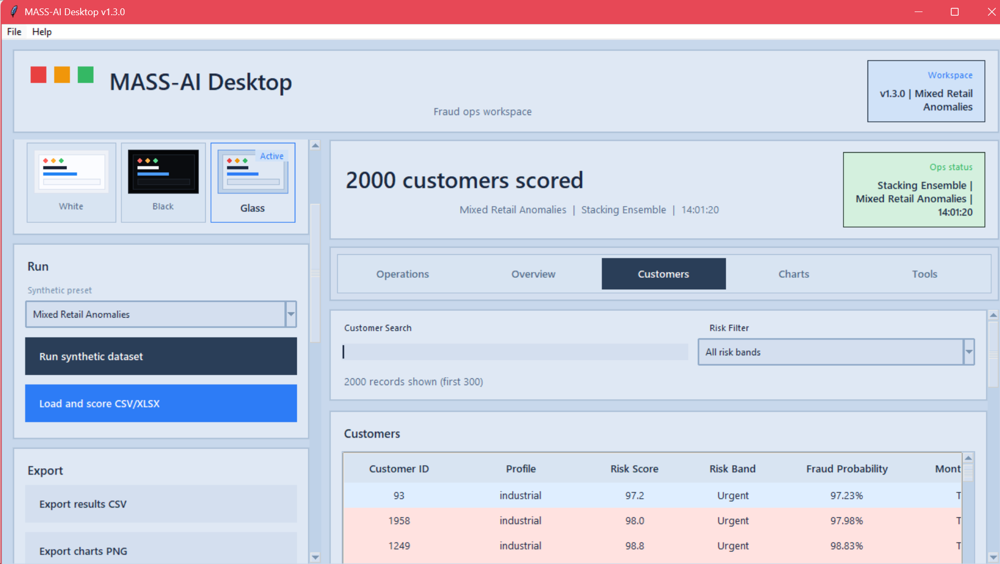
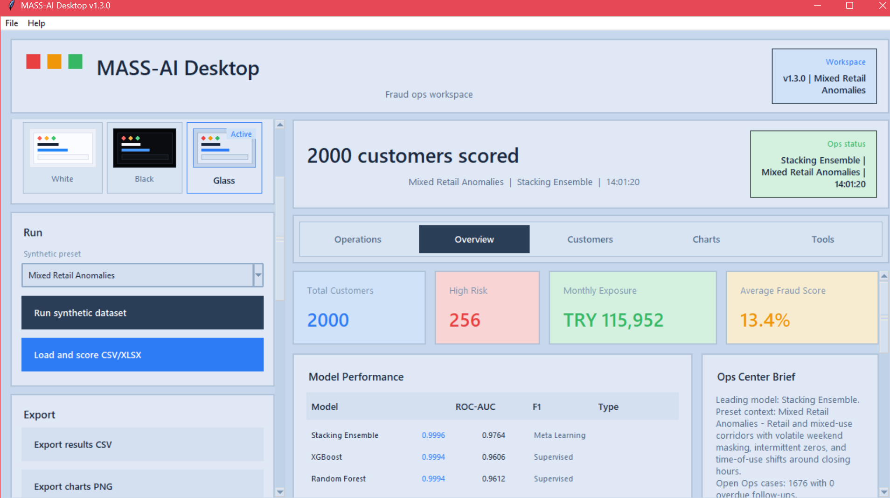
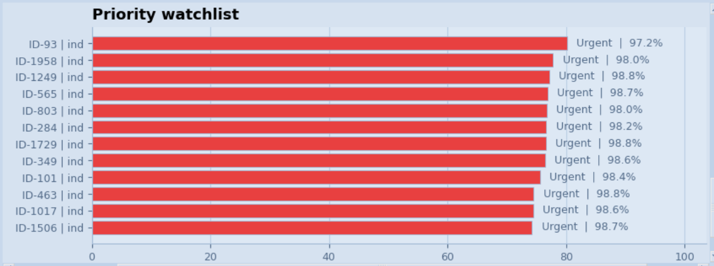
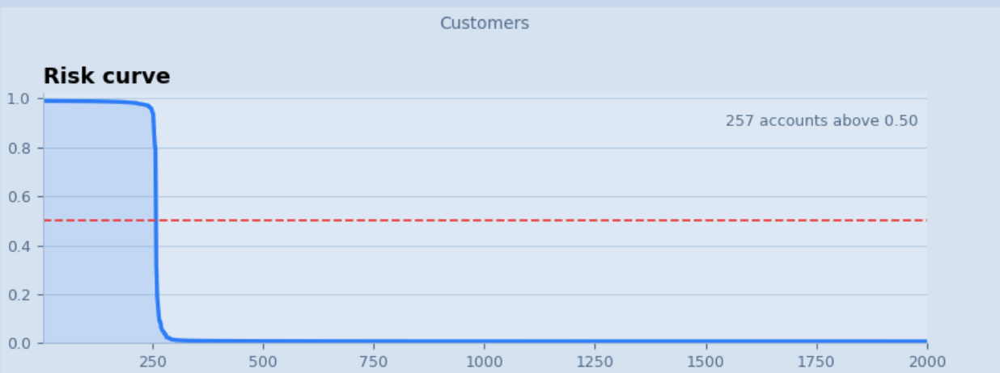
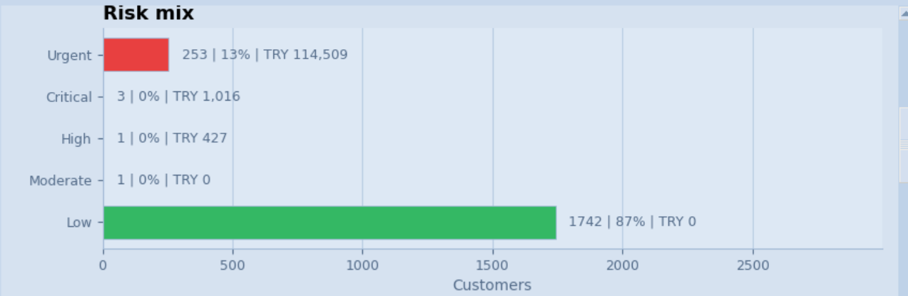
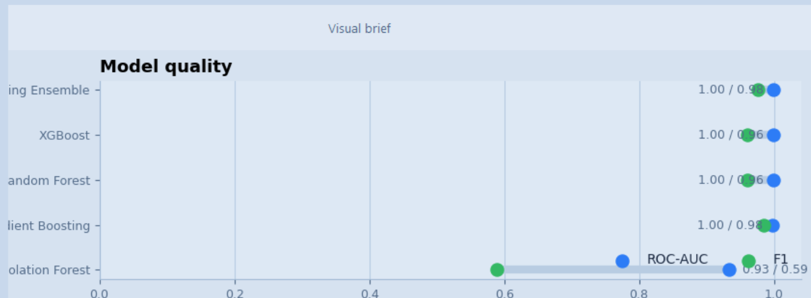

<div align="center">

# MASS AI Project

### Milli Akıllı Sayaç Sistemleri

**AI-Powered Electricity Theft Detection for Turkey's National Smart Meter Infrastructure**

<br/>

[](https://www.python.org/)
[](https://scikit-learn.org/)
[](https://xgboost.readthedocs.io/)
[](https://tensorflow.org/)
[](https://streamlit.io/)
[](LICENSE)
[](https://www.microsoft.com/windows)

</div>

<br/>

> **MASS AI** is a production-ready machine learning platform that detects electricity theft and consumption anomalies from smart meter data. Built for Turkey's MASS initiative (50 million smart meters by 2028), it targets regions where theft rates exceed **28%** — causing an estimated **₺10B+ in annual losses**.

<br/>

---

## Screenshots

| Main Workspace | Overview & KPIs |
|---|---|
|  |  |

| Priority Watchlist | Risk Curve |
|---|---|
|  |  |

| Risk Mix by Band | Model Quality |
|---|---|
|  |  |

---

## Key Features

| | Feature | Description |
|---|---|---|
| 🤖 | **6 ML Models** | Isolation Forest, XGBoost, Random Forest, Gradient Boosting, LSTM Autoencoder, Stacking Ensemble |
| 🔍 | **8 Theft Patterns** | Meter tampering, cable bypass, peak clipping, gradual reduction, intermittent bypass, and more |
| 🧮 | **20+ Features** | Statistical, temporal, and anomaly-based feature extraction per customer |
| 📊 | **ROC-AUC 0.9428** | Research-grade stacking ensemble accuracy on synthetic Turkish smart meter data |
| 🗂️ | **Ops Center** | SQLite-backed case management with audit trail — Created → Analyzed → Escalated → Resolved |
| 🌐 | **Web Dashboard** | 5-tab Streamlit UI with regional map, risk histograms, and alarm queue |
| 🖥️ | **Desktop App** | Glass-morphism Tkinter analyst workstation with chart export and HTML reports |
| ⚡ | **Synthetic Engine** | 2,000 customers × 180 days at 15-min intervals, 4 Turkish regional presets |

---

## Model Performance

| Model | ROC-AUC | F1 | Avg Precision | Type |
|---|---|---|---|---|
| 🥇 **Stacking Ensemble** | **0.9428** | **0.8727** | **0.9004** | Ensemble |
| Random Forest | 0.9461 | 0.8704 | — | Supervised |
| Gradient Boosting | 0.9380 | 0.8411 | — | Supervised |
| XGBoost | 0.9322 | 0.8440 | — | Supervised |
| Isolation Forest | 0.8208 | 0.2609 | — | Unsupervised |
| LSTM Autoencoder | 0.7482 | 0.5600 | — | Deep Learning |

> Evaluated on 2,000 synthetic customers · 12% theft rate · 4 Turkish regional profiles (Metro, Coastal, Plateau, Rural)

---

## Models In Detail

<details>
<summary><b>🌲 Isolation Forest — Unsupervised Anomaly Detection</b></summary>
<br/>

Builds an ensemble of random decision trees. Anomalous customers are **isolated in fewer splits** because they occupy sparse, unusual regions of the feature space — the fewer splits needed, the higher the anomaly score.

**Why it matters:** Requires **no labeled theft data** to train, making it deployable on day one of a smart meter rollout before any confirmed fraud cases exist.

| | |
|---|---|
| ✅ **Strengths** | Label-free, fast, handles high-dimensional features, deployable immediately |
| ⚠️ **Limitations** | Low F1 (0.26) when theft patterns overlap with legitimate low-consumption behavior |
| 🎯 **Best used for** | Cold-start deployments, initial screening, regions with zero historical fraud labels |

</details>

---

<details>
<summary><b>⚡ XGBoost — Extreme Gradient Boosting</b></summary>
<br/>

Builds trees sequentially where each new tree corrects the residual errors of the previous one. Uses **second-order gradient information** (Newton boosting) for faster convergence and stronger regularization than standard gradient boosting.

Handles the class imbalance (88% normal / 12% theft) through `scale_pos_weight`. Produces native **feature importance scores** that directly answer: *"which consumption pattern drove this suspicion?"*

| | |
|---|---|
| ✅ **Strengths** | High accuracy, built-in L1/L2 regularization, fast training, excellent feature importance |
| ⚠️ **Limitations** | Requires labeled training data, less interpretable than a single decision tree |
| 🎯 **Best used for** | Primary scoring engine when labeled historical fraud data is available |

</details>

---

<details>
<summary><b>🌳 Random Forest — Supervised Ensemble Classifier</b></summary>
<br/>

Trains hundreds of decision trees on **random subsets of data and features** (bagging + feature randomness). Final prediction is a majority vote. The randomness reduces overfitting significantly compared to a single deep tree.

Achieves the **highest standalone ROC-AUC (0.9461)** in this evaluation. Naturally robust to noisy features and outliers in consumption data.

| | |
|---|---|
| ✅ **Strengths** | Robust to noise, reliable probability estimates, resistant to overfitting |
| ⚠️ **Limitations** | Memory-heavy with many trees; needs class weighting for highly imbalanced data |
| 🎯 **Best used for** | Reliable baseline scorer and cross-validation reference model |

</details>

---

<details>
<summary><b>📈 Gradient Boosting — Sequential Error Correction</b></summary>
<br/>

Similar to XGBoost in principle but uses **first-order gradients** (classic scikit-learn implementation). Each tree is fit to the negative gradient of the loss function — progressively reducing prediction error with each stage.

Provides a strong secondary classifier that behaves differently from XGBoost due to different regularization and split strategies, making it a valuable member of the stacking ensemble.

| | |
|---|---|
| ✅ **Strengths** | Strong accuracy, well-understood behavior, good probability calibration |
| ⚠️ **Limitations** | Slower to train than XGBoost, sensitive to learning rate and tree depth |
| 🎯 **Best used for** | Ensemble diversity — its different error patterns complement XGBoost and Random Forest |

</details>

---

<details>
<summary><b>🧠 LSTM Autoencoder — Deep Learning Time-Series Model</b></summary>
<br/>

A sequence-to-sequence neural network trained to **reconstruct normal consumption sequences**. Anomalies produce high reconstruction error because the model only learned what "normal" looks like — it was never shown theft patterns.

```
Input sequence (180 days × features)
        │
   LSTM Encoder  ──►  compressed latent vector
        │
   LSTM Decoder  ──►  reconstructed sequence
        │
Reconstruction Error  ──►  Anomaly Score
```

Operates directly on raw time-series **without handcrafted features**, detecting novel theft patterns not represented in the engineered feature set.

| | |
|---|---|
| ✅ **Strengths** | No feature engineering required, detects novel/unseen patterns, models temporal dependencies naturally |
| ⚠️ **Limitations** | Requires TensorFlow, more compute, harder to explain to field analysts (ROC-AUC: 0.748) |
| 🎯 **Best used for** | Secondary validation signal, detecting pattern-drifted or novel fraud types |

</details>

---

<details>
<summary><b>🏆 Stacking Ensemble — Meta-Learner (Default Production Model)</b></summary>
<br/>

A two-layer system. In **Layer 1**, all five models independently score each customer. In **Layer 2**, a Logistic Regression meta-learner is trained on those five scores — learning *how to weight and combine* each model's judgment.

```
Layer 1 — Base Models:
  Isolation Forest  ──►  score_1  ┐
  XGBoost           ──►  score_2  │
  Random Forest     ──►  score_3  ├──►  Meta-Learner  ──►  Final Risk Score
  Gradient Boosting ──►  score_4  │     (Logistic Regression)
  LSTM Autoencoder  ──►  score_5  ┘
```

Compensates for each model's individual weaknesses. When Isolation Forest is uncertain but XGBoost and Random Forest both flag a customer, the meta-learner still produces a high risk score.

| | |
|---|---|
| ✅ **Strengths** | Best overall performance (F1: 0.8727, AP: 0.9004), robust to individual model failures |
| ⚠️ **Limitations** | All base models must be trained and loaded; adds latency vs single-model inference |
| 🎯 **Best used for** | **Production scoring** — this is the default model in the desktop app and dashboard |

</details>

---

## Architecture

```
Smart Meter Data  (raw CSV or pre-scored)
        │
        ▼
Feature Engineering  ──  20+ features
  Statistical:  mean · std · skewness · kurtosis
  Temporal:     night/day ratio · peak hour · weekday vs weekend
  Anomaly:      zero% · sudden change ratio · trend slope
        │
        ▼
 ┌──────────────────────────────────────────┐
 │              Model Ensemble              │
 │  Isolation Forest   XGBoost             │
 │  Random Forest      Gradient Boosting   │
 │  LSTM Autoencoder  ──►  Stacking Meta   │
 └──────────────────────────────────────────┘
        │
        ▼
Risk Score  +  Theft Pattern Classification
        │
        ▼
  Ops Center  (Case Management · Audit Trail)
```

---

## Synthetic Dataset

The built-in data engine generates realistic Turkish smart meter data with no external dataset required.

| Parameter | Value |
|---|---|
| Customers | 2,000 |
| Duration | 180 days |
| Reading Interval | 15 minutes |
| Theft Rate | 12% |
| Customer Profiles | Residential 70% · Commercial 20% · Industrial 10% |
| Regional Presets | Metro · Coastal · Plateau · Rural |

**8 Theft Patterns Simulated:**

| Pattern | Simulates |
|---|---|
| `constant_reduction` | Uniform consumption drop — meter tampering |
| `night_zeroing` | Zero readings at night — cable bypass |
| `random_zeros` | Sporadic zero readings — intermittent bypass |
| `gradual_decrease` | Slow monthly reduction — progressive theft |
| `peak_clipping` | Peak consumption cutoff — current limiter device |
| `weekend_masking` | Weekend anomalies — retail bypass |
| `intermittent_bypass` | Short-cycle bypass activity |
| `tamper_spikes` | Sudden high-value spikes — meter manipulation |

---

## Project Structure

Current runtime layout:

- `project/core` for shared modules
- `project/old_desktop` for the first Tkinter desktop version
- `project/new_web` for the newer Streamlit version
- `project/archive` for archived research code

```
MASS_AI_UNIFIED_APP/
├── MASS_AI_LAUNCHER.py          # Unified launcher (Tkinter)
├── START_MASS_AI.bat            # Quick start
├── INSTALL_REQUIREMENTS.bat     # One-click dependency install
├── BUILD_DESKTOP_EXE.bat        # Package to .exe (PyInstaller)
│
├── project/
│   ├── mass_ai_desktop.py       # Desktop analyst application
│   ├── mass_ai_engine.py        # ML engine + synthetic data generator
│   ├── mass_ai_domain.py        # Domain utilities & report formatting
│   ├── ops_store.py             # SQLite Ops Center persistence
│   ├── ui_kit.py                # Custom Tkinter UI components
│   │
│   ├── dashboard/app.py         # Streamlit web dashboard (5 tabs)
│   │
│   ├── legacy_pipeline/         # Research pipeline & experimental models
│   │   ├── generate_synthetic_data.py
│   │   ├── theft_detection_model.py
│   │   ├── lstm_autoencoder.py
│   │   ├── advanced_pipeline.py
│   │   └── run_pipeline.py
│   │
│   └── tests/
│       ├── test_mass_ai_engine.py
│       └── test_ops_center.py
│
├── docs/                        # Architecture & design documents
├── images/                      # Screenshots & result plots
└── business_docs/               # Research materials & presentations
```

---

## Quick Start

```bash
# 1 — Clone
git clone https://github.com/Technet43/MASS-AI-Project.git
cd MASS-AI-Project

# 2 — Install (Windows one-click)
INSTALL_REQUIREMENTS.bat

# 2 — Install (manual)
pip install -r project/requirements.txt                # both versions
pip install -r project/new_web/requirements.txt       # web only
pip install -r project/old_desktop/requirements.txt   # desktop only

# 3 — Launch
START_MASS_AI.bat                              # unified launcher
START_MASS_AI_WEB.bat                          # web dashboard only
python project/archive/legacy_pipeline/run_pipeline.py --quick  # archived research pipeline
```

---

## Requirements

| Package | Version | Purpose |
|---|---|---|
| Python | 3.10+ | Runtime |
| scikit-learn | 1.3+ | Core ML models |
| xgboost | 2.0+ | Gradient boosting |
| numpy | 1.24+ | Numerical computing |
| pandas | 2.0+ | Data processing |
| matplotlib | 3.7+ | Desktop charts |
| streamlit | 1.30+ | Web dashboard |
| plotly | 5.18+ | Interactive charts |
| tensorflow | 2.15+ | LSTM Autoencoder |
| shap | 0.43+ | Model explainability |
| openpyxl | 3.1+ | Excel export |

---

## Roadmap

- [x] Synthetic data generation (2,000 customers × 180 days)
- [x] Isolation Forest, XGBoost, Random Forest, Gradient Boosting
- [x] LSTM Autoencoder for time-series anomaly detection
- [x] Stacking Ensemble + SHAP explainability
- [x] Streamlit Dashboard v2.0 (5 tabs + regional map)
- [x] Desktop Analyst App with Ops Center (SQLite)
- [x] Executive brief generation (HTML/text)
- [x] PyInstaller packaging for Windows
- [ ] Real dataset integration (SGCC, London Smart Meter)
- [ ] 1D-CNN voltage anomaly classification
- [ ] ESP32 + CT sensor hardware prototype
- [ ] REST API for utility company integration

---

## Context

Turkey's TEDAŞ and BAŞKENTEDAŞ distribution companies face **28%+ electricity theft rates** in some regions, causing an estimated **₺10B+ in annual losses**. The MASS initiative — 50 million smart meters by 2028 — will generate massive time-series data streams requiring automated anomaly detection at scale. This project demonstrates a viable end-to-end ML architecture for that challenge.

---

## Author

**Ömer Burak Koçak**  
Electrical-Electronics Engineering · Marmara University · Class of 2026  
[kocakomerburak075@gmail.com](mailto:kocakomerburak075@gmail.com)

---

## License

[MIT License](LICENSE) — free to use, modify, and distribute with attribution.
