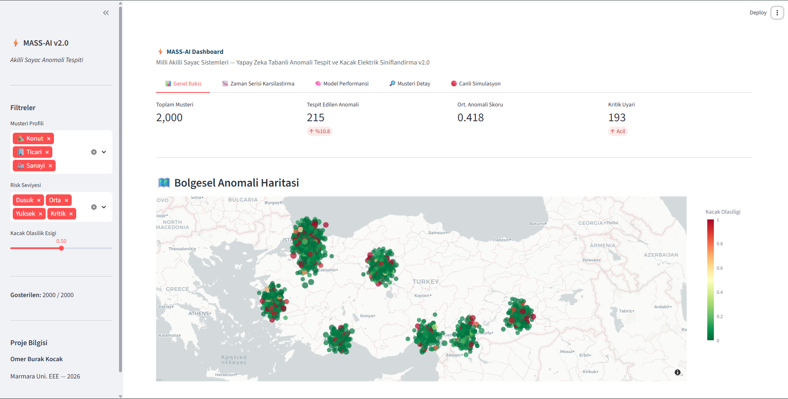
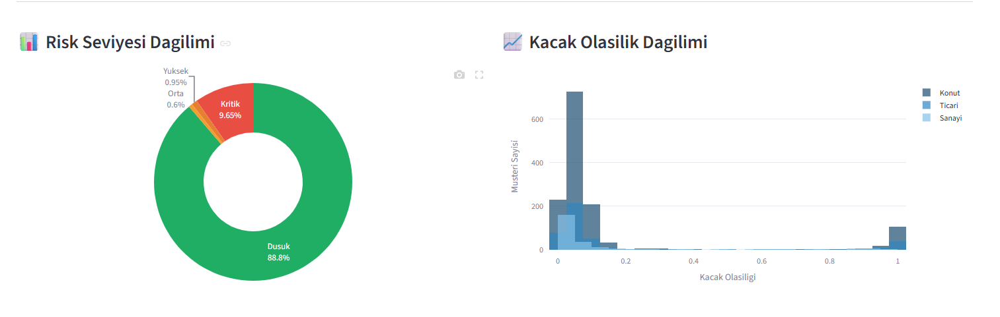
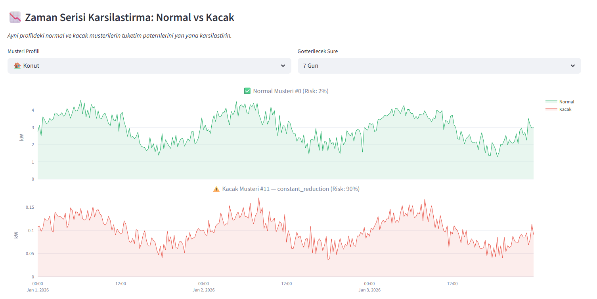
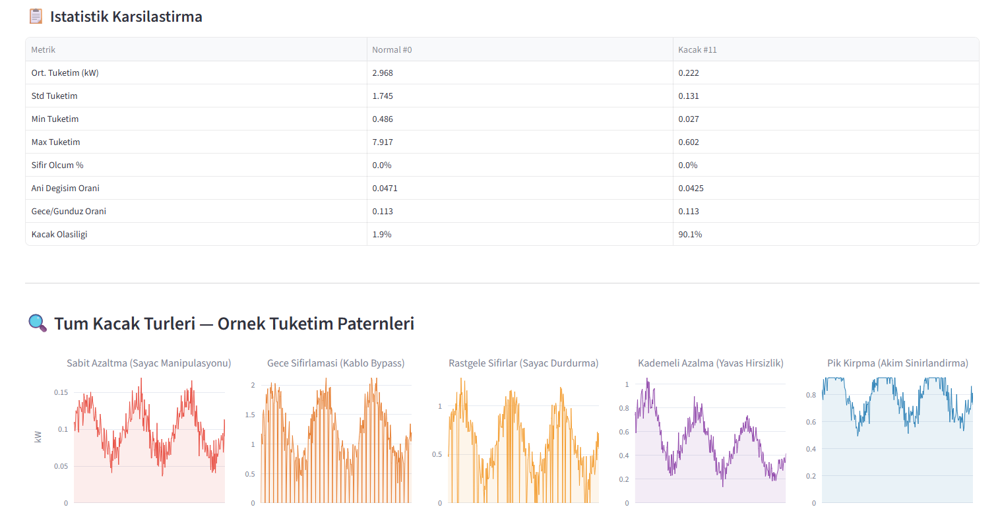
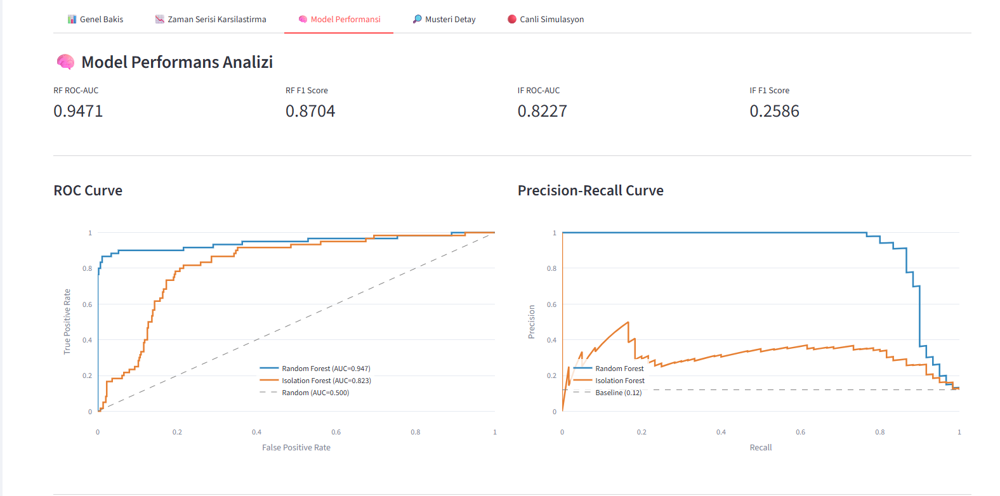
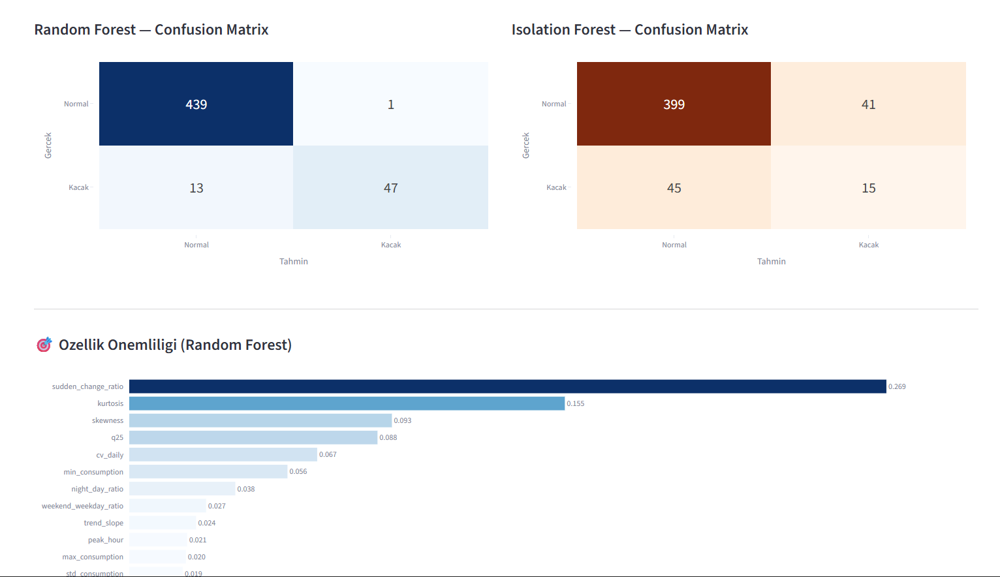
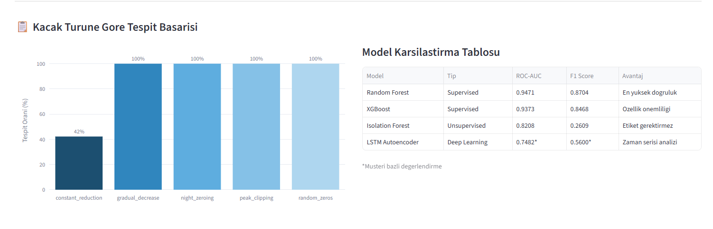
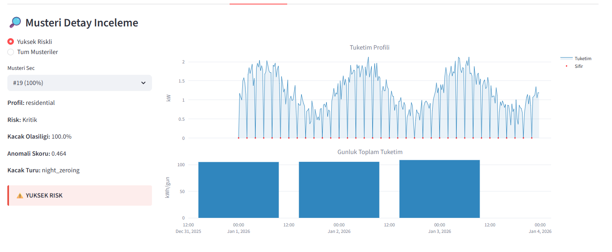
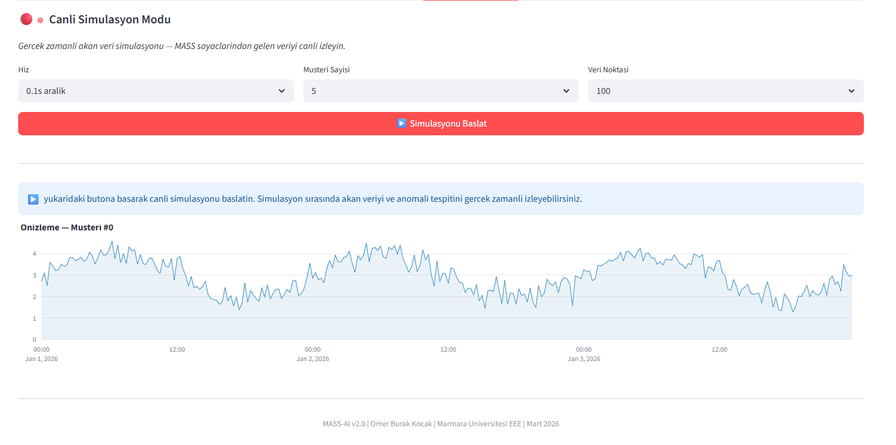

<div align="center">

# MASS AI Project

### Milli Akıllı Sayaç Sistemleri

**AI-Powered Electricity Theft Detection for Turkey's National Smart Meter Infrastructure**

<br/>

[](https://www.python.org/)
[](https://scikit-learn.org/)
[](https://xgboost.readthedocs.io/)
[](https://tensorflow.org/)
[](https://streamlit.io/)
[](LICENSE)
[](https://www.microsoft.com/windows)

</div>

<br/>

> **MASS AI** is a production-ready machine learning platform that detects electricity theft and consumption anomalies from smart meter data. Built for Turkey's MASS initiative (50 million smart meters by 2028), it targets regions where theft rates exceed **28%** — causing an estimated **₺10B+ in annual losses**.

<br/>

---

## Screenshots

| Main Workspace | Risk Distribution |
|---|---|
|  |  |

| Time-Series Comparison | Statistics & Theft Patterns |
|---|---|
|  |  |

| Model Performance | Feature Importance & Confusion Matrices |
|---|---|
|  |  |

| Detection Success | Customer Detail |
|---|---|
|  |  |

| Live Simulation |
|---|
|  |

---

## Key Features

| | Feature | Description |
|---|---|---|
| 🤖 | **Multi-Model Detection** | Random Forest, Isolation Forest, XGBoost, Gradient Boosting, LSTM Autoencoder, and stacking-oriented research workflow |
| 🔍 | **Theft Pattern Analysis** | Detects constant reduction, night zeroing, random zeros, gradual decrease, peak clipping, and related suspicious behaviors |
| 🧮 | **20+ Features** | Statistical, temporal, and anomaly-based feature extraction per customer |
| 📊 | **Interactive Analytics** | ROC curves, PR curves, confusion matrices, model comparison tables, and feature importance plots |
| 🗺️ | **Regional Monitoring** | Turkey-wide anomaly visualization with profile filters and theft probability thresholds |
| 👤 | **Customer Drill-Down** | Profile-level risk review, time-series inspection, and customer-specific anomaly explanation |
| 🌐 | **Web Dashboard** | 5-tab Streamlit UI with overview, time-series comparison, model performance, customer detail, and live simulation |
| ⚡ | **Synthetic Engine** | 2,000 customers × 180 days at 15-min intervals, 4 Turkish regional presets, and built-in theft scenario generation |

---

## Model Performance

| Model | ROC-AUC | F1 | Type |
|---|---|---|---|
| 🥇 **Random Forest** | **0.9471** | **0.8704** | Supervised |
| XGBoost | 0.9373 | 0.8468 | Supervised |
| Isolation Forest | 0.8208 | 0.2609 | Unsupervised |
| LSTM Autoencoder | 0.7482* | 0.5600* | Deep Learning |

> Current dashboard visuals prominently compare **Random Forest** and **Isolation Forest**, while the wider project research stack also includes XGBoost, Gradient Boosting, and LSTM-based experimentation.

---

## Dashboard Tabs

| Tab | What it does |
|---|---|
| **Genel Bakış** | KPI cards, regional anomaly map, filters, and high-level operational view |
| **Zaman Serisi Karşılaştırma** | Normal vs theft-like consumption comparison over configurable windows |
| **Model Performansı** | ROC-AUC, F1, PR curves, confusion matrices, and feature importance |
| **Müşteri Detay** | Single-customer inspection with profile, risk, anomaly score, and time-series view |
| **Canlı Simülasyon** | Streaming-style demo mode with speed, customer count, and preview controls |

---

## Models In Detail

<details>
<summary><b>🌲 Isolation Forest — Unsupervised Anomaly Detection</b></summary>
<br/>

Builds an ensemble of random decision trees. Anomalous customers are **isolated in fewer splits** because they occupy sparse, unusual regions of the feature space — the fewer splits needed, the higher the anomaly score.

**Why it matters:** Requires **no labeled theft data** to train, making it deployable on day one of a smart meter rollout before any confirmed fraud cases exist.

| | |
|---|---|
| ✅ **Strengths** | Label-free, fast, handles high-dimensional features, deployable immediately |
| ⚠️ **Limitations** | Lower precision than supervised models when suspicious behavior overlaps with legitimate low-consumption activity |
| 🎯 **Best used for** | Cold-start deployments and anomaly-first screening |

</details>

---

<details>
<summary><b>🌳 Random Forest — Supervised Ensemble Classifier</b></summary>
<br/>

Trains hundreds of decision trees on **random subsets of data and features**. Final prediction is a majority vote, and the injected randomness reduces overfitting compared with a single deep tree.

This is the strongest model shown directly inside the current dashboard, achieving the best visible balance between detection strength and analyst-friendly interpretability.

| | |
|---|---|
| ✅ **Strengths** | Strong ROC-AUC, robust to noisy features, reliable probability estimates, feature importance support |
| ⚠️ **Limitations** | Requires labeled data and memory grows with tree count |
| 🎯 **Best used for** | Primary supervised scorer in the current web dashboard story |

</details>

---

<details>
<summary><b>⚡ XGBoost — Extreme Gradient Boosting</b></summary>
<br/>

Builds trees sequentially where each new tree corrects residual errors from the previous one. Uses **second-order gradient information** for faster convergence and stronger regularization than classic gradient boosting.

| | |
|---|---|
| ✅ **Strengths** | High accuracy, strong regularization, excellent feature ranking |
| ⚠️ **Limitations** | More tuning-sensitive than simpler baselines |
| 🎯 **Best used for** | High-performance supervised scoring and ensemble diversity |

</details>

---

<details>
<summary><b>🧠 LSTM Autoencoder — Deep Learning Time-Series Model</b></summary>
<br/>

A sequence-to-sequence neural network trained to **reconstruct normal consumption sequences**. Anomalies produce high reconstruction error because the model only learned what "normal" looks like.

```text
Input sequence (time-series)
        |
        v
   LSTM Encoder  -> latent representation
        |
        v
   LSTM Decoder  -> reconstructed sequence
        |
        v
Reconstruction Error -> Anomaly Score
```

| | |
|---|---|
| ✅ **Strengths** | Learns directly from sequences, useful for novel pattern discovery |
| ⚠️ **Limitations** | Higher compute cost and harder to explain to non-ML stakeholders |
| 🎯 **Best used for** | Secondary validation and time-series anomaly research |

</details>

---

## Architecture

```text
Smart Meter Data (raw CSV or processed features)
        |
        v
Feature Engineering  ->  20+ features
  Statistical: mean, std, skewness, kurtosis
  Temporal:    night/day ratio, peak hour, weekday vs weekend
  Anomaly:     zero %, sudden change ratio, trend slope
        |
        v
Model Layer
  Isolation Forest
  Random Forest
  XGBoost
  Gradient Boosting
  LSTM Autoencoder
        |
        v
Risk Score + Theft Pattern Classification
        |
        v
Web Dashboard
  - Overview
  - Time-Series Comparison
  - Model Performance
  - Customer Detail
  - Live Simulation
```

---

## Synthetic Dataset

The built-in data engine generates realistic Turkish smart meter data with no external dataset required.

| Parameter | Value |
|---|---|
| Customers | 2,000 |
| Duration | 180 days |
| Reading Interval | 15 minutes |
| Theft Rate | 12% |
| Customer Profiles | Residential 70% · Commercial 20% · Industrial 10% |
| Regional Presets | Metro · Coastal · Plateau · Rural |

**Example Theft Patterns Simulated:**

| Pattern | Simulates |
|---|---|
| `constant_reduction` | Uniform consumption drop — meter tampering |
| `night_zeroing` | Zero readings at night — cable bypass |
| `random_zeros` | Sporadic zero readings — intermittent bypass |
| `gradual_decrease` | Slow monthly reduction — progressive theft |
| `peak_clipping` | Peak consumption cutoff — current limiter device |

---

## Project Structure

```text
MASS-AI/
├── START_MASS_AI.bat              # Main web launch
├── START_MASS_AI_WEB.bat          # Direct Streamlit launch
├── INSTALL_REQUIREMENTS.bat       # Dependency install
├── RUN_SMOKE_TESTS.bat            # Compile + unit checks
│
├── project/
│   ├── core/                      # Shared engine, domain, metadata, helpers
│   ├── web/
│   │   ├── dashboard/app.py       # Streamlit web dashboard
│   │   └── requirements.txt       # Web dependency set
│   ├── data/                      # Demo and processed datasets
│   ├── archive/                   # Research / older experimental code
│   └── tests/                     # Unit tests
│
├── docs/                          # Architecture and rollout notes
└── images/web/                    # Dashboard screenshots
```

---

## Quick Start

```bash
# 1 — Clone
git clone https://github.com/Technet43/MASS-AI-Project.git
cd MASS-AI-Project

# 2 — Install
INSTALL_REQUIREMENTS.bat

# 3 — Launch
START_MASS_AI.bat

# Direct web launch
streamlit run project/web/dashboard/app.py
```

---

## Requirements

| Package | Version | Purpose |
|---|---|---|
| Python | 3.10+ | Runtime |
| scikit-learn | 1.3+ | Core ML models |
| xgboost | 2.0+ | Gradient boosting |
| numpy | 1.24+ | Numerical computing |
| pandas | 2.0+ | Data processing |
| streamlit | 1.30+ | Web dashboard |
| plotly | 5.18+ | Interactive charts |
| tensorflow | 2.15+ | LSTM Autoencoder |
| shap | 0.43+ | Model explainability |
| openpyxl | 3.1+ | Excel support |

---

## Roadmap

- [x] Synthetic data generation (2,000 customers × 180 days)
- [x] Regional anomaly map and profile-aware filtering
- [x] Random Forest + Isolation Forest dashboard evaluation views
- [x] Time-series comparison for normal vs theft-like customers
- [x] Customer detail inspection with risk explanation
- [x] Live simulation mode for streaming-style demos
- [ ] Real utility dataset integration
- [ ] REST/API-backed product architecture
- [ ] Stronger production deployment story beyond local Streamlit runtime

---

## Branch Notes

- `main` is the **web-only** branch.
- `desktop-local` preserves the earlier local desktop version.

---

## Context

Turkey's smart meter modernization effort will generate massive time-series data streams requiring automated anomaly detection at scale. MASS AI is built as a practical end-to-end analytics layer for that challenge: score suspicious behavior, visualize risk geographically, compare patterns directly, and give analysts a usable review surface.

---

## Author

**Ömer Burak Koçak**  
Electrical-Electronics Engineering · Marmara University · Class of 2026  
[kocakomerburak075@gmail.com](mailto:kocakomerburak075@gmail.com)

---

## License

[MIT License](LICENSE) — free to use, modify, and distribute with attribution.
